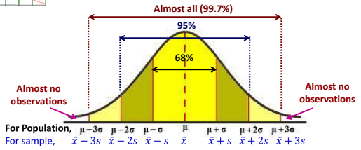
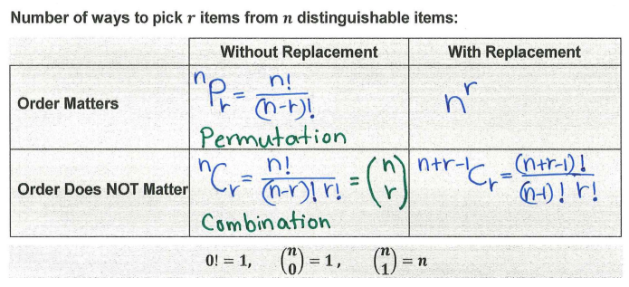
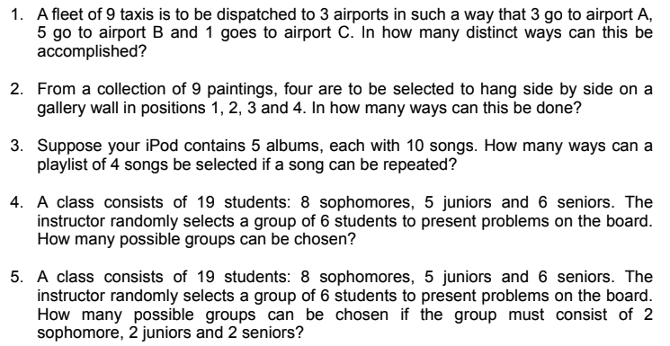

```{r,echo=F, message=F}
library(dplyr)
library(kableExtra)
```

# About

These are class notes and R code for Dorcas Ofori-Boaten's STAT-461 : Introduction to Statistics I for Fall term 2021 at Portland State University. 

# D1 : Tues. September 28, 2021

- Dorcas or Professor Dorcas

- first of series of three courses 

- originally from Ghana (small country)

- passion and drive for math and analysis 

- goal of all classes is academic **excellence** 

- send email anytime of day to doforib2@pdx.edu

- please read through syllabus 

- first homework will be assigned on Thursday and due the following Thurseday 

- due dates will switch to Tuesday after the midterm 

- extra credit can be carried onto something in the future if it isn't needed on direct homework 

- some extra credit will be in the slides (pay attention)

- homework due at 11:5PM (wont work at 12:00)

## Chapter 1 : What is Statistics? 

- statistics is applied math which allows you to study data to form a judgment in a case of real world applications. 

- have discipline that is math related, but more applied in it's focus 

- get data, then summary or form of information from that data

- real world scenarios aren't fixed or absolute 

- in collection of data there is variability, but we are still able to capture the variability (that is the endtails of statistics)

- When you say something is average, you are saying it with some confidence

- random errors also have to be continuous 

### Population , Sample, Census
  
```{r, echo=F}
Parent <- c("Population : well defined collection of objects in a study (focus of the study)", "Sample : smaller portion of population that reflects population", "Census : all desired information of a population ")
Child <- c("Parameter", "Statistic", "")
Example <- c("all PSU Student", "sample of students", "")
data.frame(Parent,Child, Example)  %>% kable() %>%
  kable_material_dark()

```

- the first letter of each of these goes back to the parent

- Example: Difference between rookie salaries between Yankee and Marlon players. 

  - What are the collection of objects for this study?  (aka the **the population**)

    - The entire collection of people, who include all Yankee players and all Marlon players 

- a **sample** is a smaller portion of the population used to predict the nature of the entire population 

  - there are different ways to sample different schemes 
  
  - make sure the sample is a true reflection of the structure of the population 
  
- the **census** is when you go into population and collection all desired information person by person (or object to object)

  - list of desired information is know as a **census** 

```{r, echo=F}
Types <- c("Descriptive", "Inferential")
Defintition <- c("allow the methods to calculate summaries (mean, variance, ect.)","want to infer, predict what will happen next")
Z <- c("","Probability")
Methods <- c("graphical (histogram on) and numerical", "")
data.frame(Types, Defintition, Methods) %>% kable() %>%
  kable_material_dark()
```

- once able to describe sampel and move it onto the population you are moving into inferential population 

### Descriptive Statistics 

- for graphical methods looks at ..

1. the center

2. the variation

3. the distribution $\frac{a_{1}+a_{2}+a_{3}+...+a_{n}}{n}$

4. time 

5. outliers 

- histogram is bars laid side by side to show data in a study 

### Skew

- left skew, right skew, and symmetric distribution 

```{r, echo=F}
skew <- c("Right Skew", "Left Skew", "Symmetric")
definition <- c("data is on the left with gradation will decreasing to the right", "tallest bar will be to the right and gradion will be to the left", "equibalance state, where the tallest bar is in the middle and divides the data into two equal parts")

data.frame(skew,definition) %>% kable() %>%
  kable_material_dark()
```

- for a normal distribution mean, median, and mode are the same thing 

- based on skewness you can tell where mean will fall 

- other graph patterns : U shape, uniform, Binodal (two bumps), bell-shaped

### Mean 

- Population Mean : $\mu=\frac{x_{1}+x_{2}+x_{3}+...+x_{n}}{N}$

- Sample Mean : $\overline{x}=\frac{x_{1}+x_{2}+x_{3}+...+x_{n}}{n}$

- Sample Mean (textbook) : the sample mean , "y-bar", of _n_ measured responses $y_{1},y_{2},...,y_{n}$

$$\overline{y}=\frac{1}{n}\sum_{i=1}^{n}y_{i}$$

- the mean is sensitive to outliners (not robust)

- the mean is not an accurate value to give on its own. 

- trimmed mean doesn't mean you throw away, you simply compute the mean you are intrested in 

### Median 

- sample median : $\widetilde{x}$

- to find the median : order the data from smallest to largest and find the value in the middle 

  - if total number of population or sample is even then will need to take the two middle values and divide them by 2. 

- median is robust to outliers, because the center will still be the center regardless 

- advisable to use the route of median for summaries 

- to find the median : order the data set and find the value in the middle 

### Mode

- highest frequency 

- value that has appeared the highest number of times

- mode is essential descriptor for data 

### Range

Max - Min 

### Variance and Standard Deviation

- Population Variance :  $\sigma ^{2}=\frac{[(x_{1}-\mu)^{2}+(x_{2}-\mu)^{2}+...(x_{n}-\mu)^{2}]}{N}=\frac{(x_{i}-\overline{x})^{2}}{N}$

- Population Standard Deviation : $\sigma=\sqrt{\sigma^{2}}$

- Sample Variance : $s^{2}=\frac{[(x_{1}-\overline{x})^{2}+(x_{2}-\overline{x})^{2}+...(x_{n}-\overline{x})^{2}]}{n}=\frac{(x_{i}-\overline{x})^{2}}{n}$

- Sample Variance (textbook) : $$s^{2}=\frac{1}{n-1}\sum_{i=1}^{n}(y_{i}-\overline{y})^{2}$$

- Sample Standard Deviation : $s=\sqrt{s^{2}}$

### Summary 

- Statistics is the real world application of math which allows one to study data in order to form a judgment.

- Population is the involves the all objects whereas a sample is just a representative subset of the population. 

- Two types of statistics : 
  - Descriptive which is the method of calculating descriptive values such as mean, median, mode, and variance, as well as graphical methods such as a histogram (see Histogram Trial- Day 1)
  - Inferential statistics uses the descriptions to infer or make predictions about the future. 
  
- skew data has the bulk of the data beside it. 
  - left skew, bulk of data is on right (mean < mode) 
  - right skew, bulk of data is on left (mean > mode)

- Population uses geek symbols, and Sample uses the alphabet. 

- I need to start recognizing the matching the symbols and equations faster in my mind. This will help me understand the regression class better. 

# D2 : Thur. September 30, 2021

$\Rightarrow$ Review from last class : 

- Characterizing a Set of Measurements : Graphical Methods

  - Distribution Patterns : U Shape, Uniform, Bimodal, Bell-Shape (Normal)
  
  - Symmetry (balancing in the middle), right skewed (mean to the right of data), left skewed (mean to the left of data)
  
  - Histograms can be used with frequency, relative frequency or percentage. 
  
- Characterizing a Set of Measurements : Numerical Methods

  - Mean (average)
  
    - Sample Mean : $\overline{y}=\frac{1}{n}\sum_{i=1}^{n}y_{i}$
    
    - Population Mean : $\mu =\frac{1}{N}\sum_{i=1}^{N}Y_{i}$
    
    - Mean is sensitive to outliers because it uses every data value
    
  - Median (middle value)
  
    - Median is not sensitive to outliers because it only looks at middle values
    
    - For even data sets the mean of the two middle values is the median 
    
  - Mode (appears most frequently)
  
  - Range (Max - Min)
  
    - sensitive to outliers
  
  - Variance (avg. **squared** deviation of data from mean)
  
    - Population Variance : $\sigma^{2}=\frac{1}{N}\sum_{i=1}^{N}(Y_{i}-\mu)^{2}$
    
    - Sample Variance : $s^{2}=\frac{1}{n-1}\sum_{i=1}^{n}(y_{i}-\overline{y})^{2}=\frac{1}{n-1}[\sum_{i=1}^{n}y_{i}^{2}-n\overline{y}^{2}]$
    
    - sensitive to outliers
  
  - Standard Deviation (avg. deviation of data from mean)
  
    - Population Standard Deviation : $\sigma=\sqrt{\sigma^{2}}$
    
    - Sample Standard Deviation : $s=\sqrt{s^{2}}$
    
    - Approximate Sample : $s\approx \frac{\text{Range}}{4}$
    
    - sensitive to outliers
    
  - Smaller variance or standard deviation indicates that the data are more consistent 
  
  
### Examples
**In class** : Given a random sample of 10 observations such that the sample mean is 5 and $\sum_{i=1}^{n}y_{i}^{2}=350$. Compute the sample standard deviation. (Hint use the shortcut formula)

Given $n=10$ and $\overline{y}=5$ the sample standard deviation is : 

\begin{equation} \label{a}
\begin{split} 
s & = \sqrt{\frac{1}{n-1}[\sum_{i=1}^{n}y_{i}^{2}-n\overline{y}^{2}]}\\
& = \sqrt{\frac{1}{10-1}[350-(10*5^{2})]}\\
& = \sqrt{\frac{100}{9}}\\
& = 3.33
\end{split}
\end{equation}


**Example 11** : Listed below are the distances (in kilometers) from a home to local supermarkets. 

```{r}
data <- c(1.1, 4.2, 2.3, 4.7, 2.7, 3.2, 5.6, 3.3, 3.5, 3.8, 4.0, 1.5, 4.5, 4.5, 2.5, 4.8, 3.3, 5.5, 6.5, 12.3) 
data
```

(a) Compute the Range (12.3-1.1)

```{r}
range <- max(data)-min(data)
range
```

(b) Approximate the standard deviations using the range 

$s\approx \frac{\text{Range}}{4}=\frac{11.2}{4}=2.8$

(c) The following output shows numerical summaries obtained with the R package pastecs. 

```{r}
library(pastecs)
stat.desc(data)
```

Why do you think the computed s (2.343) is slightly smaller than the approximated value in part (b)? 

Simple, becauase part(b) is an approximation. 


### The Empirical Rule 
When the data is bell-shaped (normally distributed) then the **Empirical Rule** can be used to find the percentage of the data with 1, 2, or 3 standard deviations about the mean. 

<center>



</center> 

- first use the **Empirical Rule** to find out the number of standard deviations (z) correspond to bounds of interval

- next transfer z to data value (y) of variable using the following formula

Data Value = Mean + z*Standard Deviation 

- sample : $y=\overline{y}+zs$

- population : $Y=\mu +z\sigma$

### Summary 

- Review descripitive statistics including examples

- The Empirical Rule : 68-95-99.7

# D3 : Tues. October 5, 2021

- moving into chapter 2 which deals with more probability 

- review empirical rule 

### Examples

**Example** : Resting breathing rates for college-age students are approximately normally distributed (bell-shaped) with mean 12 and standard deviation 2.3 beaths per minute. 

(a) What percentage of students have between 9.7 and 14.3 breaths per minute? 

$z_{1}=\frac{y-\overline{y}}{s}=\frac{9.7-12}{2.3}=-1$

$z_{2}=\frac{14.3-12}{2.3}=1$

Accoding to the empirical rule, about 68% of students have breath rate within 1 standard deviaiton of the mean. 

(b) What percentage of students have less than 7.4 breaths per minute? 

$z=\frac{7.4-12}{2.3}=-2$

$\frac{100-95}{2}=2.5\%$

2.5% of students have brath rates less than 7.4 breaths per minute. 

**Example** Select all the histograms for which the empirical rule is valid or good to use.

(f), because it is the only one that follows the bell shape curve 

### Probability 

What is probability? 

**<span style="color: orange;">Probability</span>** refers to the study of randomness and uncertainty. 

- Probability indicates how likely it is for something to occur in a random experiment. For example, how likely or what is the chance that if you roll a fair 100-sided die (slides labeled 1 through 100), how likely you observe 65 on the top. 

An **<span style="color: orange;">experiment</span>** is any activity / process whose outcome s is subject to uncertainty. 

- Toss a coin, Roll a Die once or twice. 

A **<span style="color: orange;">sample space</span>** is the set of all possible outcome of a random experiment. Denoted by S. 

- Toss a coin once $S=\{\text{heads, tails}\}$

An **<span style="color: orange;">event</span>** is a subset (small collection of outcomes) of sample space and denoted by capital letter. Event and set are interchangeable. 

- What are the outcomes with at least one head when a coin is tossed twice? 

$S=\{\text{HH, HT, TH, TT}\}$      $A=\{\text{HT,TH}\}$

- If an event has only a single point, then it is a simple event. Otherwise it is a compound event. 

The **<span style="color: orange;">Null set (empty event)</span>** is an event with no elements. Denoted $\emptyset$ or $\{\}$.

### Set Theory Notation

The **<span style="color: orange;">complement</span>** of an event A is the set of all outcomes in the sample space that do not belong to A. Denoted : $A^{c}$, $A'$ or $\overline{A}$.

The **<span style="color: orange;">intersection</span>** of two events A and B. The collection of all outcomes that appear in both A AND B. Denoted : $A\cap B$

- $A\cap B=B\cap A$

The **<span style="color: orange;">union</span>** of two events A and B. The collection of all outcomes that appear in either A OR B OR in both. Denoted : $A\cup B$

Event B is a **<span style="color: orange;">subset</span>** of Event A if **every** element of B is also in A. This is denoted by $B\subset A$

If $A\cap B=\emptyset$, then A and B are **<span style="color: orange;">disjoint</span>** or **<span style="color: orange;">mutually exclusive</span>** events. 

$A_{1}, A_{2},...,A_{n}$ are **<span style="color: orange;">exhaustive</span>** events if and only if $A_{1}\cup A_{2}\cup ...\cup A_{n}=S$

$A_{1}, A_{2},...,A_{n}$ are pairwise **<span style="color: orange;">mutually exclusive (dijoint)</span>** and **<span style="color: orange;">exhaustive</span>** events :

1. if and only if $A_{1}\cap A_{j}=\emptyset \forall i\ne j$

<center> AND </center>

2. $A_{1}\cup A_{2}\cup ...\cup A_{n}=S$


### Basic Properties

$A\cap \emptyset = \emptyset$ 

$A\cup \emptyset =A$ 

$A\cap \overline{A}=\emptyset$ 

$A\cup \overline{A}=S$ 

$\overline{S}=\emptyset$ 

$\overline{(\overline{A})}=A$

### DeMorgan's Law

$(\overline{A\cap B})=\overline{A}\cup \overline{B}$

$(\overline{A\cup B})=\overline{A}\cap \overline{B}$

### Distributive Law

$A\cap (B\cup C) = (A\cap B)\cup (A\cap C)$

$A\cup (B\cap C) = (A\cup B)\cap (A\cup C)$

### Probability 

- probability of an event $A:P(A)$ 

$$P(A)=\frac{\text{count(numbers) of outcomes in event A}}{\text{count (number) of outcomes in the sample space}}$$

Note : $0\leq P(A)\leq 1$

### Counting Rules

**<span style="color: orange;">Product rule for k-tuplets</span>** : If a process can be broken down into a sequence of K steps, then the total number of possible outcomes is the product of the number of outcomes at each step. 

- Suppose a license plate number is formed with 3 letters, followed by 3 numbers. How many different outcomes are possible? $26^{3}\cdot 10^{3}=17576000$

The **<span style="color: orange;">Factorial Rule</span>** is the number of ways to order or rank or arrange n objects is $n!=n(n-1)(n-2)...(3)(2)(1)$. 

Notes 0!=1, and 1!=1

- There are four candidates for a job. The members of the search committee will rank the four candidates from strongest to weakest. How many different outcomes are possible? $4!=24$

The **<span style="color: orange;">Combination rule</span>** has the following set up : 

1. n different items are available

2. select k of the n items without replacement

3. order of selection does not matter 

$${n\choose k}C={n\choose k}=\frac{n!}{k!(n-k)!}$$

Note : "n choose k"

- How many 5 element subsets are in the set S={2, 3, 4, 5, 6, 7, 8, 9}?

The **Permutation Rule** has the following set up : 

1. n different items are available

2. Select k of the n items without replacement 

3. Order of selection matter.

$${n\choose k}P=\frac{n!}{(n-k)!}$$

- There are ten candidates for a job. The search committee will choose four of them, and rank the chosen four from strondest to weakest. How many different outcomes are possible? 

### Counting Rules : Summary 

<center>

</center>

### More Examples 
These are not extra credit, but try these to get counting technique down. 

<center>

</center>

### Probability Examples
A student prepares an exam by studying a list of 10 problems. She can solve 6 of them. For the exam, the instructor selects 5 problems at random from the 10 on the list given to the students. What is the probability that the student can solve all 5 problems on the exam? 

$\frac{6\choose5}{10\choose 5}$

- we want to see how many combinations are possible in the space, so it doesn't matter how many the student can solve when calculating the denominator. 

### Extra Credit 

The college of liberal arts and sciences is made up of 12 freshmen, 10 sophomores, 7 juniors and 7 seniors. What is the probability of selecting a student from each group to form a student advisory council? 

Answer : 0.42%

### Summary 

- Homework 1 is due the end of day Thursday (complete)

- Email Extra Credit to Professor before class Thursday (complete)

- Today we did examples applying The Empirical Rule and the equation $z=\frac{y-\overline{y}}{s}$

- Went over basic probability definitions, notation, and equations 

- Four counting rules where order does and doesn't matter, and there is or is not replacement. (see picture above)

- Should work through examples given today before next class, and read chapter 2 of textbook. 

- Start prepping practice test problems (with homework and in class examples) to study this weekend. 

# D4 : Thur. October 7th, 2021

